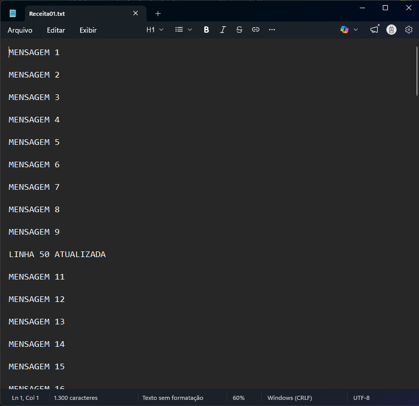

# TC3 - Read and Edit File

Este exemplo descreve um programa que faz a leitura de um arquivo de texto e edita a linha informada na entrada do Function Block. O texto desta linha é substituido pelo texto informado na entrada:

ENTRADAS DO BLOCO:

- sFilePath  : CAMINHO ONDE ESTA O ARQUIVO DE TEXTO .TXT

- nLineToEdit: NUMERO A LINHA A SER EDITADA

- sNewContent: TEXTO QUE SERA INSERIDO NA LINHA INDICADA SUBSTITUINDO O TEXTO ORIGINAL

- bStart     : PULSO PARA REALIZAR A ESCRITA. UMA NOVA ESCRITA SERA REALIZADA APOS UM NOVO PULSO

- bDone      : BIT DE CONCLUIDO

- bBusy      : BIT DE OCUPADO

- bError     : BIT DE ERRO

- nErrorId   : CODIGO DO ERRO
  
/***********************************************************************************************/

EXEMPLO DO BLOCO CONFIGURADO:

CODIGOS DE ERRO:
  
IMAGEM DO ARQUIVO EDITADO NA LINHA 10:

